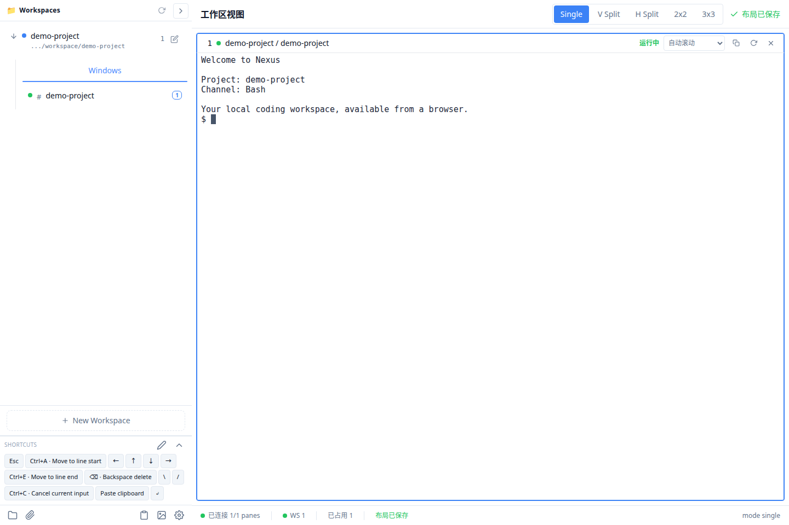
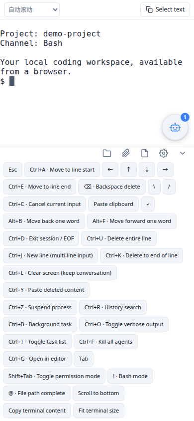

# Nexus

Run and manage your local coding agents from a desktop or phone browser.

[简体中文](README_CN.md) · [Getting started](docs/QUICKSTART_EN.md) · [Releases](https://github.com/Jiang0977/nexus/releases) · [GPL-3.0-or-later](LICENSE.md)

Nexus is a single-user, self-hosted workbench. Open a project, start Claude,
Codex or a shell, and return to the same terminal after closing your browser.
Desktop split panes let you follow several channels; mobile controls let you
send input, upload files and resume work away from your desk.

This is an independently maintained derivative of
[Nexus4CC](https://github.com/librae8226/nexus4cc), originally developed by
librae8226, faywong and contributors. This fork adds a Rust runtime, terminal
state recovery, an opt-in native PTY backend and expanded workspace tooling.
See [attribution](LICENSE.md) and [changes](CHANGELOG.md).

<p>
  
  
</p>

## What you can do

- Organize directories as projects with multiple agent or shell channels.
- Use single, vertical, horizontal, 2×2 or 3×3 terminal layouts on desktop.
- Browse and edit files; upload, download, rename, move and copy them.
- Save, search, reorder and insert reusable prompts without auto-submitting.
- Launch Claude/Codex profiles and browse/resume Codex history.
- Use dark/light themes and install the browser UI as a PWA over HTTPS.

The default **tmux** backend keeps sessions alive across browser disconnects
and Nexus server restarts. The **native** Rust PTY backend is opt-in/staging.
Neither backend promises to preserve running processes across a host reboot.
PWA installation does not make terminal access work while the server is offline.

## Install

Supported deployment target: **Linux with systemd user services**, including
WSL2 with systemd enabled. The binary release targets **Linux x86_64 with glibc
2.39 or newer** (Ubuntu 24.04 or newer). Other Linux systems can build from source.
macOS and Windows-native installations are not supported by this release.

Install runtime prerequisites on Ubuntu:

```bash
sudo apt update
sudo apt install -y tmux zsh python3 curl git ca-certificates
```

Download the binary archive and `SHA256SUMS` from [Releases](https://github.com/Jiang0977/nexus/releases), then:

```bash
sha256sum --ignore-missing -c SHA256SUMS
mkdir -p "$HOME/.local/lib/nexus"
tar -xzf nexus-4.5.0-linux-x86_64.tar.gz -C "$HOME/.local/lib/nexus" --strip-components=1
cd "$HOME/.local/lib/nexus"
./setup.sh
```

Save the generated password and open **http://127.0.0.1:59000**.
The installer creates `.env` and three user services: Nexus, tmux and the
native supervisor (idle while using tmux). Keep the installation directory in place.

To build from source, install Rust stable and a C/C++ build toolchain plus CMake,
then run:

```bash
git clone https://github.com/Jiang0977/nexus.git
cd nexus
./setup.sh
```

The checked-in frontend bundle means Node is not needed just to run Nexus.
Source setup builds all Rust binaries and may take several minutes.
For foreground mode, run `./setup.sh --configure-only`, then `bash start.sh`.
Read the [complete tutorial](docs/QUICKSTART_EN.md) for first login, agent profiles,
phone access, password reset and troubleshooting.

## Security and permissions

**An authenticated terminal has the permissions of the account running Nexus.**
`WORKSPACE_ROOT` is not a shell sandbox. Claude/Codex launchers currently bypass
their permission prompts, and Codex also bypasses its sandbox. Read
[SECURITY.md](SECURITY.md) before connecting agents to sensitive projects.

The default listener is loopback-only. Use a private VPN or an authenticated
HTTPS proxy for remote access. Do not expose the server directly to the internet.
Never publish `.env`, `data/`, terminal history or profile credentials.

## Development and updates

Development requires Node.js 22.13+ (or a newer supported LTS), npm, Rust stable,
and the runtime prerequisites above.

```bash
npm ci
npm --prefix frontend ci
npx playwright install --with-deps chromium
npm run check
```

Production serves `frontend/dist/`; frontend edits need `npm run build:frontend`.
Source deployments use `npm run deploy:service -- --frontend`. Service scope is
auto-detected; when both scopes exist, set `NEXUS_SERVICE_SCOPE=user` or `system`.
See the [deployment runbook](docs/DEPLOYMENT-RUNBOOK.md) before updating.

## Documentation

| Guide | Purpose |
|---|---|
| [English tutorial](docs/QUICKSTART_EN.md) / [中文教程](docs/QUICKSTART.md) | Installation through your first agent session |
| [Deployment runbook](docs/DEPLOYMENT-RUNBOOK.md) | Updates, backup, rollback and uninstall |
| [Architecture](docs/ARCHITECTURE.md) / [code map](docs/code.md) | Runtime design and source navigation |
| [Current roadmap](docs/CURRENT-ROADMAP.md) | Current scope and remaining work |
| [Contributing](CONTRIBUTING.md) | Checks, bug reports and pull requests |
| [Security](SECURITY.md) | Permissions and private vulnerability reports |

## License

This fork is distributed under **GPL-3.0-or-later**. Original author copyrights
and third-party notices are retained. See [LICENSE.md](LICENSE.md),
[COPYING](COPYING) and [THIRD_PARTY.md](THIRD_PARTY.md).
